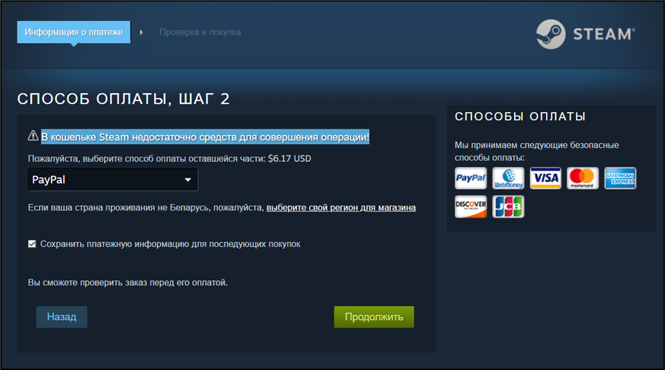
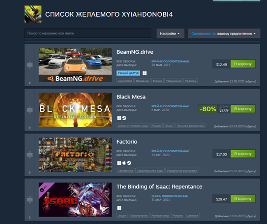

# Тест кейсы

# *Заголовок:* Попытка покупки игры при нехватке средств на кошельке Steam.

## ***Предусловие:*** Открыта страница игры [https://store.steampowered.com/app/400/Portal](https://store.steampowered.com/app/400/Portal). Пользователь уже был авторизован. У пользователя недостаточно средств на кошельке Steam что бы купить выбранную игру.

## Шаги:

1. Перейти на страницу игры [https://store.steampowered.com/app/400/Portal](https://store.steampowered.com/app/400/Portal)
2. Нажать кнопку «В корзину»
3. Нажать кнопку «Купить для себя»

## *Ожидаемый результат:* Отображение сообщения о нехватке средств на кошельке Steam.

## *Фактический результат:* В кошельке Steam недостаточно средств для совершения операции.

## *Результат:* Положительный

---

# *Заголовок**:*** Удаление игры из списка желаемых

## ***Предусловие:*** Пользователь зашёл на главную страницу Steam. Пользователь уже был авторизован.

## Шаги:

1. Перейти на сайт [https://store.steampowered.com](https://store.steampowered.com/).
2. Навести курсор на кнопку «Магазин».
3. Выбрать вкладку «Список желаемого».
4. Нажать кнопку «Убрать» на выбранной игре.

## ***Ожидаемый результат:*** из списка желаемых пропадёт выбранная игра.

### До:

### После:

## ***Фактический результат:*** из списка пропала выбранная игра

## ***Результат:*** Положительный

---

# *Заголовок**:*** Добавление игры в корзину

## ***Предусловие:*** Пользователь зашёл на главную страницу Steam. Пользователь уже был авторизован.

## Шаги:

1. Перейти на страницу игры. Пример: [https://store.steampowered.com/app/400/Portal/](https://store.steampowered.com/app/400/Portal/).
2. Нажать на кнопку «В корзину».

## ***Ожидаемый результат:*** переадресация в корзину пользователя, где в списке есть выбранная игра.

## ***Фактический результат:*** в корзине присутствует выбранная игра.

## ***Результат:*** Положительный

---

# *Заголовок**:*** Поиск игр с использованием кириллицы

## ***Предусловие:*** Пользователь зашёл на главную страницу Steam. Пользователь уже был авторизован.

## Шаги:

1. Написать в поисковом поле звание выбранной игры на кириллице. Пример: “Портал”
2. Нажать на клавишу “Enter”.

## ***Ожидаемый результат:*** Отображение игры “Portal” в результате поиска.

## ***Фактический результат:*** в результате поиска нет игры “Portal”

## ***Результат:*** Отрицательный

---

# ***Заголовок:*** Написание и отправка отзыва отзыва

## ***Предусловие:*** Пользователь зашёл на главную страницу Steam. Пользователь уже был авторизован.

## Шаги:

1. Зайти на страницу выбранной игры. Пример: [https://store.steampowered.com/app/457140/Oxygen_Not_Included/](https://store.steampowered.com/app/457140/Oxygen_Not_Included/)
2. Написать текст в поле отзыва.
3. Нажать кнопку “Опубликовать”.

## ***Ожидаемый результат:*** Отображение отзыва в списке отзывов.

## ***Фактический результат:*** Отзыв отображается в списке отзывов.

## ***Результат:*** Положительный

---

# *Заголовок**:*** Редактирование пункта “О себе” в профиле пользователя

## ***Предусловие:*** Пользователь зашёл на страницу “Мой профиль”. Пользователь уже был авторизован.

## Шаги:

1. Нажать кнопку “Редактировать”.
2. Отредактировать поле “О себе”.
3. Нажать кнопку “Сохранить”.

## ***Ожидаемый результат:*** Изменение описания профиля пользователя.

### До:

### После:

## ***Фактический результат:*** Описание было изменено.

## ***Результат:*** Положительный

---

# ***Заголовок:*** Смена фона профиля

## ***Предусловие:*** Пользователь зашёл на страницу “Мой профиль”. Пользователь уже был авторизован.

## Шаги:

1. Нажать кнопку “Редактировать”.
2. Выбрать вкладку “Фон профиля”.
3. Выбрать один фон из предложенных.
4. Нажать кнопку “Сохранить”.

## ***Ожидаемый результат:*** Изменение фона профиля.

### До:

### После:

## ***Фактический результат:*** Фон профиля был изменён.

## ***Результат:*** Положительный

---

# ***Заголовок:*** Создание группы

## ***Предусловие:*** Пользователь зашёл на страницу “Группы”. Пользователь уже был авторизован.

## Шаги:

1. Нажать кнопку “Создать группу…”.
2. Заполнить необходимые поля.
3. Пройти валидацию полей по уникальности.
4. Нажать кнопку “Создать”.

## ***Ожидаемый результат:*** Переадресация на страницу администрирования группы.

## ***Фактический результат:*** Успешное создание группы.

## ***Результат:*** Положительный

---

# ***Заголовок:*** Изменение настроек приватности

## ***Предусловие:*** Пользователь зашёл на страницу “Мой профиль”. Пользователь уже был авторизован.

## Шаги:

1. Нажать кнопку “Редактировать”.
2. Выбрать вкладку “Приватность”.
3. Изменить выбранный пункт приватности. Например: “Список друзей”.

## ***Ожидаемый результат:*** Появления уведомления о авто сохранении.

### До:

### После:

## ***Фактический результат: Получено*** уведомление о успешном авто сохранении.

## ***Результат:*** Положительный

---

# ***Заголовок:*** Изменение значка профиля

## ***Предусловие:*** Пользователь зашёл на страницу “Мой профиль”. Пользователь уже был авторизован.

## Шаги:

1. Нажать кнопку “Редактировать”.
2. Выбрать вкладку “Значок напоказ”.
3. Изменить значок на другой.

## ***Ожидаемый результат:*** Изменение значка в профиле.

### До:

### После:

## ***Фактический результат:* Значок в профиле был изменён**.

## ***Результат:*** Положительный

---